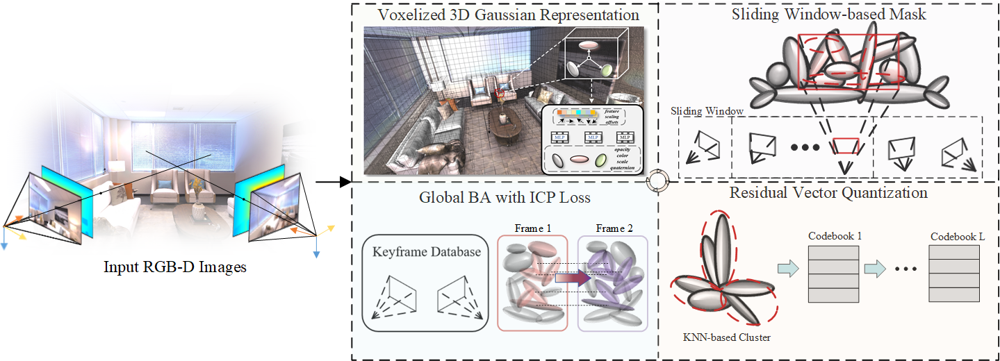

<!-- PROJECT LOGO -->

<p align="center">

  <h1 align="center">Voxelized 3D Gaussian Rrepresentation for Dense Visual
SLAM on Embedded Vision System</h1>
  <h3 align="center">IJCV Submission</h3>
  <div align="center"></div>
</p>

<p align="center">
  <a href="">
    
  </a>
</p>

<br>
<!-- TABLE OF CONTENTS -->
<details open="open" style='padding: 10px; border-radius:5px 30px 30px 5px; border-style: solid; border-width: 1px;'>
  <summary>Table of Contents</summary>
  <ol>
    <li>
      <a href="#installation">Installation</a>
    </li>
    <li>
      <a href="#demo">Online Demo</a>
    </li>
    <li>
      <a href="#usage">Usage</a>
    </li>
    <li>
      <a href="#downloads">Downloads</a>
    </li>
    <li>
      <a href="#benchmarking">Benchmarking</a>
    </li>
    <li>
      <a href="#acknowledgement">Acknowledgement</a>
    </li>
    <li>
      <a href="#citation">Citation</a>
    </li>
  </ol>
</details>

# Notes

Our method is a plug-and-play approach that can be integrated with different GS-SLAM frameworks. We will maintain separate branches for different versions of the method. The current version supports SplaTAM.

- [x] We have updated the `README.md` and are preparing to open-source our code！  
- [x] Code for main parts, including `optimizer`, `renderer`, `tracking and mapping modules`, `Learnable Mask`, `Voxelized Residual Quantization`
- [x] Installation setup
- [ ] Voxelized Scene Representation

<!-- TABLE OF CONTENTS -->
<details open="open" style='padding: 10px; border-radius:5px 30px 30px 5px; border-style: solid; border-width: 1px;'>
  <summary>Table of Contents</summary>
  <ol>
    <li>
      <a href="#installation">Installation</a>
    </li>
    <li>
      <a href="#demo">Online Demo</a>
    </li>
    <li>
      <a href="#usage">Usage</a>
    </li>
    <li>
      <a href="#downloads">Downloads</a>
    </li>
    <li>
      <a href="#benchmarking">Benchmarking</a>
    </li>
    <li>
      <a href="#acknowledgement">Acknowledgement</a>
    </li>
    <li>
      <a href="#citation">Citation</a>
    </li>
    <li>
      <a href="#developers">Developers</a>
    </li>
  </ol>
</details>

## Installation

##### (Recommended)
VCGS-SLAM has been benchmarked with Python 3.10, Torch 1.12.1 & CUDA=11.6. However, Torch 1.12 is not a hard requirement and the code has also been tested with other versions of Torch and CUDA such as Torch 2.3.0 & CUDA 12.1.

The simplest way to install all dependences is to use [anaconda](https://www.anaconda.com/) and [pip](https://pypi.org/project/pip/) in the following steps: 

```bash
conda create -n vcgs-slam python=3.10
conda activate vcgs-slam
conda install -c "nvidia/label/cuda-11.6.0" cuda-toolkit
conda install pytorch==1.12.1 torchvision==0.13.1 torchaudio==0.12.1 cudatoolkit=11.6 -c pytorch -c conda-forge
pip install -r requirements.txt
```

<!-- Alternatively, we also provide a conda environment.yml file :
```bash
conda env create -f environment.yml
conda activate vcgs-slam
``` -->

## Demo

### Online

You can VCGS-SLAM your own environment with an iPhone or LiDAR-equipped Apple device by downloading and using the <a href="https://apps.apple.com/au/app/nerfcapture/id6446518379">NeRFCapture</a> app.

Make sure that your iPhone and PC are connected to the same WiFi network, and then run the following command:

 ```bash
bash bash_scripts/online_demo.bash configs/iphone/online_demo.py
```

### Offline

You can also first capture the dataset and then run VCGS-SLAM offline on the dataset with the following command:

```bash
bash bash_scripts/nerfcapture.bash configs/iphone/nerfcapture.py
```

### Dataset Collection

If you would like to only capture your own iPhone dataset using the NeRFCapture app, please use the following command:

```bash
bash bash_scripts/nerfcapture2dataset.bash configs/iphone/dataset.py
```

## Usage

We will use the iPhone dataset as an example to show how to use VCGS-SLAM. The following steps are similar for other datasets.

To run VCGS-SLAM, please use the following command:

```bash
python scripts/vsgsslam.py configs/iphone/vsgsslam.py
```

To visualize the final interactive VCGS-SLAM reconstruction, please use the following command:

```bash
python viz_scripts/final_recon.py configs/iphone/vsgsslam.py
```

To visualize the VCGS-SLAM reconstruction in an online fashion, please use the following command:

```bash
python viz_scripts/online_recon.py configs/iphone/vsgsslam.py
```

To export the splats to a .ply file, please use the following command:

```bash
python scripts/export_ply.py configs/iphone/vsgsslam.py
```

`PLY` format Splats can be visualized in viewers such as [SuperSplat](https://playcanvas.com/supersplat/editor) & [PolyCam](https://poly.cam/tools/gaussian-splatting).

To run 3D Gaussian Splatting on the VCGS-SLAM reconstruction, please use the following command:

```bash
python scripts/post_vsgsslam_opt.py configs/iphone/post_vsgsslam_opt.py
```

To run 3D Gaussian Splatting on a dataset using ground truth poses, please use the following command:

```bash
python scripts/gaussian_splatting.py configs/iphone/gaussian_splatting.py
```

## Downloads

DATAROOT is `./data` by default. Please change the `input_folder` path in the scene-specific config files if datasets are stored somewhere else on your machine.

### Replica

Download the data as below, and the data is saved into the `./data/Replica` folder. Note that the Replica data is generated by the authors of iMAP (but hosted by the authors of NICE-SLAM). Please cite iMAP if you use the data.

```bash
bash bash_scripts/download_replica.sh
```

### TUM-RGBD

```bash
bash bash_scripts/download_tum.sh
```

### ScanNet

Please follow the data downloading procedure on the [ScanNet](http://www.scan-net.org/) website, and extract color/depth frames from the `.sens` file using this [code](https://github.com/ScanNet/ScanNet/blob/master/SensReader/python/reader.py).

<details>
  <summary>[Directory structure of ScanNet (click to expand)]</summary>

```
  DATAROOT
  └── scannet
        └── scene0000_00
            └── frames
                ├── color
                │   ├── 0.jpg
                │   ├── 1.jpg
                │   ├── ...
                │   └── ...
                ├── depth
                │   ├── 0.png
                │   ├── 1.png
                │   ├── ...
                │   └── ...
                ├── intrinsic
                └── pose
                    ├── 0.txt
                    ├── 1.txt
                    ├── ...
                    └── ...
```
</details>


We use the following sequences: 
```
scene0000_00
scene0059_00
scene0106_00
scene0181_00
scene0207_00
```

### ScanNet++

Please follow the data downloading and image undistortion procedure on the <a href="https://kaldir.vc.in.tum.de/scannetpp/">ScanNet++</a> website. 
Additionally for undistorting the DSLR depth images, we use our <a href="https://github.com/Nik-V9/scannetpp">own variant of the official ScanNet++ processing code</a>. We will open a pull request to the official ScanNet++ repository soon.

We use the following sequences: 

```
8b5caf3398
b20a261fdf
```

For b20a261fdf, we use the first 360 frames, due to an abrupt jump/teleportation in the trajectory post frame 360. Please note that ScanNet++ was primarily intended as a NeRF Training & Novel View Synthesis dataset.

### Replica-V2

We use the Replica-V2 dataset from vMAP to evaluate novel view synthesis. Please download the pre-generated replica sequences from <a href="https://github.com/kxhit/vMAP">vMAP</a>.

## Benchmarking

For running VCGS-SLAM, we recommend using [weights and biases](https://wandb.ai/) for the logging. This can be turned on by setting the `wandb` flag to True in the configs file. Also make sure to specify the path `wandb_folder`. If you don't have a wandb account, first create one. Please make sure to change the `entity` config to your wandb account. Each scene has a config folder, where the `input_folder` and `output` paths need to be specified. 

Below, we show some example run commands for one scene from each dataset. After SLAM, the trajectory error will be evaluated along with the rendering metrics. The results will be saved to `./experiments` by default.

### Replica

To run VCGS-SLAM on the `room0` scene, run the following command:

```bash
python scripts/vsgsslam.py configs/replica/vsgsslam.py
```

To run SplaTAM-S on the `room0` scene, run the following command:

```bash
python scripts/vsgsslam.py configs/replica/vsgsslam_s.py
```

For other scenes, please modify the `configs/replica/vsgsslam.py` file or use `configs/replica/replica.bash`.

### TUM-RGBD

To run VCGS-SLAM on the `freiburg1_desk` scene, run the following command:

```bash
python scripts/vsgsslam.py configs/tum/vsgsslam.py
```

For other scenes, please modify the `configs/tum/vsgsslam.py` file or use `configs/tum/tum.bash`.

### ScanNet

To run VCGS-SLAM on the `scene0000_00` scene, run the following command:

```bash
python scripts/vsgsslam.py configs/scannet/vsgsslam.py
```

For other scenes, please modify the `configs/scannet/vsgsslam.py` file or use `configs/scannet/scannet.bash`.

### ScanNet++

To run VCGS-SLAM on the `8b5caf3398` scene, run the following command:

```bash
python scripts/vsgsslam.py configs/scannetpp/vsgsslam.py
```

To run Novel View Synthesis on the `8b5caf3398` scene, run the following command:

```bash
python scripts/eval_novel_view.py configs/scannetpp/eval_novel_view.py
```

For other scenes, please modify the `configs/scannetpp/vsgsslam.py` file or use `configs/scannetpp/scannetpp.bash`.

### ReplicaV2

To run VCGS-SLAM on the `room0` scene, run the following command:

```bash
python scripts/vsgsslam.py configs/replica_v2/vsgsslam.py
```

To run Novel View Synthesis on the `room0` scene post VCGS-SLAM, run the following command:

```bash
python scripts/eval_novel_view.py configs/replica_v2/eval_novel_view.py
```

For other scenes, please modify the config files.


# ✏️ Acknowledgement
Our implementation is heavily based on <a href="https://vladimiryugay.github.io/gaussian_slam/index.html">Gaussian-SLAM</a> and <a href="https://github.com/muskie82/MonoGS">MonoGS</a> and <a href="https://github.com/GradientSpaces/LoopSplat">Loop-Splat</a>, <a href="https://github.com/spla-tam/SplaTAM">SplaTAM</a>. We thank the authors for their open-source contributions. If you use the code that is based on their contribution, please cite them as well. We thank [Yue Pan](https://github.com/YuePanEdward) for the fruitful discussion.<br>

