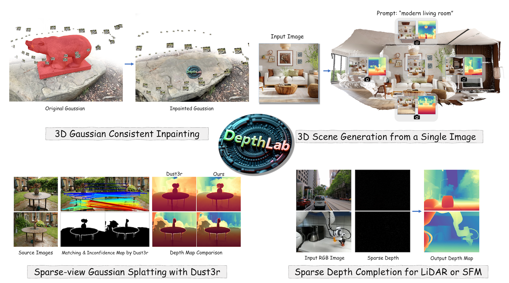

# DepthLab: From Partial to Complete

This repository represents the official implementation of the paper titled "DepthLab: From Partial to Complete".

[](https://johanan528.github.io/depthlab_web/)
[](https://arxiv.org/abs/2412.18153)
[](https://www.apache.org/licenses/LICENSE-2.0)
[](https://huggingface.co/Johanan0528/DepthLab/tree/main)

<p align="center">
    <a href="https://johanan528.github.io/"><strong>Zhiheng Liu*</strong></a>
    ·
    <a href="https://felixcheng97.github.io/"><strong>Ka Leong Cheng*</strong></a>
    ·
    <a href="https://github.com/qiuyu96"><strong>Qiuyu Wang</strong></a>
    ·
    <a href="https://ffrivera0.github.io/"><strong>Shuzhe Wang</strong></a>
    ·
    <a href="https://ken-ouyang.github.io/"><strong>Hao Ouyang</strong></a>
    ·
    <a href="https://icetttb.github.io/"><strong>Bin Tan</strong></a>
    ·
    <a href="https://scholar.google.com/citations?user=Mo_2YsgAAAAJ&hl=zh-CN"><strong>Kai Zhu</strong></a>
    ·
    <a href="https://shenyujun.github.io/"><strong>Yujun Shen</strong></a>
    ·
    <a href="https://cqf.io/"><strong>Qifeng Chen</strong></a>
    ·
    <a href="http://luoping.me/"><strong>Ping Luo</strong></a>
    <br>
  </p>

We present **DepthLab**, a robust depth inpainting foundation model that can be applied to various downstream tasks to enhance performance. Many tasks naturally contain partial depth information, such as (1) *3D Gaussian inpainting*, (2) *LiDAR depth completion*, (3) *sparse-view reconstruction with DUSt3R*, and (4) *text-to-scene generation*. Our model leverages this known information to achieve improved depth estimation, enhancing performance in downstream tasks. We hope to motivate more related tasks to adopt DepthLab.



## 📢 News
* 2024-12-25: Inference code and paper is released.
* [To-do]: Release the training code to facilitate fine-tuning, allowing adaptation to different mask types in your downstream tasks.

## 🛠️ Setup

### 📦 Repository

Clone the repository (requires git):

```bash
git clone https://github.com/Johanan528/DepthLab.git
cd DepthLab
```

### 💻 Dependencies

Install with `conda`: 
```bash
conda env create -f environment.yaml
conda activate DepthLab
```

### 📦 Checkpoints
Download the Marigold checkpoint [here](https://huggingface.co/prs-eth/marigold-depth-v1-0), the image encoder checkpoint [here](https://huggingface.co/laion/CLIP-ViT-H-14-laion2B-s32B-b79K), and our checkpoints at [Hugging Face](https://huggingface.co/Johanan0528/DepthLab/tree/main). The downloaded checkpoint directory has the following structure:
```
.
`-- checkpoints
    |-- marigold-depth-v1-0
    |-- CLIP-ViT-H-14-laion2B-s32B-b79K
    `-- DepthLab
        |-- denoising_unet.pth
        |-- reference_unet.pth
        `-- mapping_layer.pth
```

## 🏃 Testing on your cases

### 📷 Prepare images, masks, known depths
Masks: PNG/JPG or Numpy, where black (0) represents the known regions, and white (1) indicates the predicted areas.

Known depths: Numpy

Images: PNG/JPG

#### We provide a case in 'test_cases' folder.
### 🎮 Run inference

```bash
cd scripts
bash infer.sh
```

You can find all results in `output/in-the-wild_example`. Enjoy!

### ⚙️ Inference settings

The default settings are optimized for the best result. However, the behavior of the code can be customized:
  - `--denoise_steps`: Number of denoising steps of each inference pass. For the original (DDIM) version, it's recommended to use 20-50 steps.
  - `--processing_res`: The processing resolution. **For cases where the mask is sparse, such as in depth completion scenarios, it is advisable to set the 'processing_res' and the mask size to be the same in order to avoid accuracy loss in the mask due to resizing. For non-sparse completion tasks, we recommend using a resolution of 640 or 768 for inference.**
  - `--normalize_scale`: When the known depth scale cannot encompass the global scale, it is possible to reduce the normalization scale, allowing the model to better predict the depth of distant objects.
  - `--strength`: When set to 1, the prediction is entirely based on the model itself. When set to a value less than 1, the model is partially assisted by interpolated masked depth to some extent.
  - `--blend`: Whether to use Blend Diffusion, a commonly used technique in image inpainting.
  - `--refine`: If you want to refine depthmap of DUSt3R, or you have a full initial depthmap, turn this option on.
## 🌺 Acknowledgements
This project is developped on the codebase of [Marigold](https://github.com/prs-eth/Marigold) and [MagicAnimate](https://github.com/magic-research/magic-animate). We appreciate their great works! 

## 🎓 Citation
Please cite our paper:
```bibtex
@article{liu2024depthlab,
  title={DepthLab: From Partial to Complete},
  author={Liu, Zhiheng and Cheng, Ka Leong and Wang, Qiuyu and Wang, Shuzhe and Ouyang, Hao and Tan, Bin and Zhu, Kai and Shen, Yujun and Chen, Qifeng and Luo, Ping},
  journal={arXiv preprint arXiv:2412.18153},
  year={2024}
}
```
